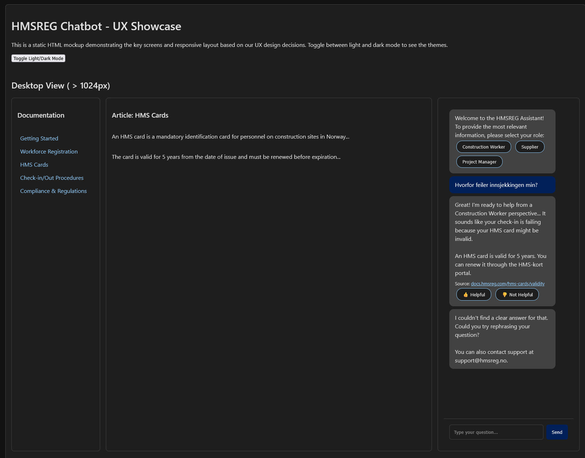
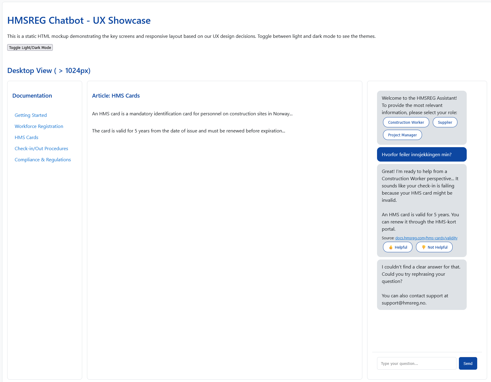

# Refleksjonsrapport - Programmering med KI

## 1. Gruppeinformasjon

**Gruppenavn:** [SG-Gruppe-3-Kun]

**Gruppemedlemmer:**

-   [Frida Berge-Robertson] - [231156 / frida.b.berge@himolde.no]
-   [Sebastian Vambheim Thunestvedt] - [242083 / sethu0051@himolde.no]
-   [Stina Isabella Sakariassen Rabben] - [220959 / stina.i.s.rabben@himolde.no]
-   [Oliver Matre Hille] - [240971 / oliver.m.hille@himolde.no]

**Dato:** [04.12.2025]

---

## 2. Utviklingsprosessen

### 2.1 Oversikt over prosjektet

Prosjektet vårt er en chatbot utviklet for HMSREGs dokumentasjon. Hovedmålet med applikasjonen er å gi brukere av HMSREG – som leverandører, underleverandører, bygningsarbeidere, prosjektledere og administratorer – raske og presise svar på spørsmål om systembruk, krav, prosedyrer og feilsøking. Målet er å redusere belastningen på support, sikre konsistente svar, øke brukernes effektivitet og gjøre HMSREG-dokumentasjonen mer tilgjengelig.

HMSREG er et sentralt system for håndtering av mannskaps- og kontraktsinformasjon i bygge- og anleggsbransjen i Norge, spesielt rettet mot seriøsitet og etterlevelse av HMS-forskrifter. Systemet er omfattende, og dokumentasjonen på `docs.hmsreg.com` er tilsvarende detaljert og bred. Dette er en styrke for de som kjenner systemet godt, men en betydelig utfordring for nye brukere, eller for brukere som kun sporadisk trenger å finne spesifikk informasjon. Manuell gjennomgang av store mengder tekst for å finne svar på konkrete spørsmål er tidkrevende og ineffektivt, noe som ofte fører til frustrasjon og en høyere supportbelastning for HMSREG.

Hovedmålet med applikasjonen er å fundamentalt endre måten brukere interagerer med HMSREGs dokumentasjon. Ved å tilby en intuitiv og responsiv chat-interface, ønsker vi å:

1.  **Redusere antall supporthenvendelser:** Mange henvendelser til kundestøtte skyldes at brukere ikke finner informasjonen selv, selv om den eksisterer i dokumentasjonen. Chatboten skal fungere som et "førstelinjeforsvar" og besvare rutinespørsmål.
2.  **Øke brukervennligheten og selvhjulpenheten:** Spesielt for underentreprenører, som ofte er sporadiske brukere av systemet og har mindre erfaring med å navigere i omfattende teknisk dokumentasjon, skal chatboten gjøre det enklere å finne svar. Typiske spørsmål kan omfatte mannskapslister, HMS-kortkrav, dokumentasjonsstandarder for ulike prosjekter, og hvordan man korrigerer feil i registreringer. Disse brukerne har ofte begrenset tid og behov for raske, presise svar for å unngå forsinkelser i prosjekter.
3.  **Forbedre kvaliteten på brukerinteraksjonen:** Ved å levere presise og kontekstuelt relevante svar, vil brukerne oppleve en høyere grad av tilfredshet og redusert friksjon i arbeidet sitt.

Løsningens kjerne bygger på RAG (Retrieval-Augmented Generation) prinsippet. I motsetning til en enkel søkefunksjon, som kun returnerer relevante dokumenter eller avsnitt, går RAG et skritt videre. Systemet vårt utfører følgende prosess:

-   **Informasjonshenting (Retrieval):** Brukerens spørsmål analyseres og brukes til å søke gjennom en vektordatabase (ChromaDB) som inneholder embeddings av all relevant dokumentasjon fra `docs.hmsreg.com`. Dette sikrer at kun de mest kontekstuelt relevante delene av dokumentasjonen hentes ut.
-   **Generering (Generation):** De hentede dokumentfragmentene sendes deretter sammen med brukerens spørsmål til en stor språkmodell (LLM, f.eks. Gemini). LLM-en bruker denne informasjonen til å generere et konsist, presist og menneskelignende svar, spesifikt tilpasset spørsmålet, og som bygger på informasjonen funnet i dokumentasjonen. Dette minimerer risikoen for "hallusinasjoner" – der LLM-en dikter opp feilaktig informasjon – og sikrer at svarene er faktabaserte og verifiserbare.

### 2.2 Arbeidsmetodikk

Vi organiserte arbeidet gjennom jevnlige møter på Teams, i gjennomsnitt en gang i uken. Vi fulgte progresjonen i forelesningene og tok valg bassert på valgene som ble tatt og anbefalt i forelesningene. Under disse gruppemøtene var det vanlig at én person delte skjerm i VS Code, mens alle bidro med innspill og kodet sammen i sanntid.

-   **Hvordan fordelte dere oppgaver?**
    Oppgaver ble fordelt der det var fornuftig. I startfasen var det vanskelig å fordele oppgaver, men research og brainstorming for eksempel, ble gjort individuelt, før resultatene ble diskutert i fellesskap. Hver enkelt jobbet i sin egen Git-branch for å unngå konflikter. Når en oppgave var fullført, ble koden slått sammen i `main`-branchen etter en gjennomgang.

-   **Hvilke verktøy brukte dere for samarbeid og hvordan det fungerte? (f.eks. Git, og Teams)**

    -   **Git:** Vi brukte Git for versjonskontroll, med en branch-basert arbeidsflyt. Dette fungerte svært bra og ga oss god kontroll på endringer og samarbeid om kode.
    -   **Teams:** Brukt for alle våre gruppemøter, skjermdeling og diskusjoner.
    -   **VS Code:** Skjermdeling i VS Code ble brukt for mob-programmering.

-   **Hvordan brukte dere KI-verktøy i prosessen?**
    KI-verktøy var en integrert og aktiv del av hele prosessen vår, og vi fulgte BMAD-metoden for å strukturere og gjennomføre prosjektet.

I praksis brukte vi Gemini CLI som vårt primære verktøy. Inne i CLI-et benyttet vi oss av de spesialiserte agentene fra BMAD-rammeverket som Product Manager, UX Designer og Architect for å drive prosjektet fremover i de ulike fasene.

Mer konkret brukte vi KI til å:

-   **Generere dokumentasjon:** Utforme alt fra tekniske spesifikasjoner til brukerhistorier og denne refleksjonsrapporten.
-   **Skrive kode:** Generere boilerplate, implementere funksjoner og foreslå løsninger på tekniske problemer.
-   **Analysere problemer:** KI hjalp oss med å identifisere risikoer og foreslå mottiltak.
-   **Fasilitere brainstorming:** Vi brukte KI-styrte teknikker som "Five Whys" for å komme til roten av brukerproblemer og "Question Storming" for å utforske ulike løsningsretninger.

Vi startet opprinnelig med Claude Code, men gikk raskt over til å bruke Gemini CLI ettersom alle gruppemedlemmene hadde tilgang til en sjenerøs gratisversjon (free tier), noe som gjorde det enkelt for alle å delta aktivt.

---

### 2.3 Teknologi og verktøy

**Frontend:**

-   Next.js 14 (App Router) med TypeScript
-   Tailwind CSS
-   shadcn/ui (UI-komponenter)
-   React Context API (state management)
-   Lucide React (ikoner)

**Backend:**

-   Python 3.11+
-   FastAPI (web framework)
-   Pydantic AI (RAG framework med type-sikkerhet)
-   Beautiful Soup 4 (web scraping)
-   langchain_text_splitters (document chunking)
-   uvicorn (ASGI server)
-   slowapi (rate limiting)
-   instructor (for strukturert LLM output)

**Database:**

-   Supabase (PostgreSQL - for samtaler, feedback, analytics)
-   ChromaDB (vektordatabase - for dokumentembeddings)

**KI-verktøy:**

-   Google Gemini 2.5 Pro (produksjon - chat responses)
-   text-embedding-004 (embeddings/søk)
-   Gemini CLI (utvikling)
-   Claude Pro (AI-assistert dokumentasjon)

**Andre verktøy:**

-   VS Code (editor)
-   Git/GitHub (versjonskontroll)
-   Microsoft Teams (ukentlige møter og fortløpende chat)
-   Vercel (planlagt frontend hosting)
-   Railway (planlagt backend hosting)

### 2.4 Utviklingsfaser

Prosjektet har fulgt BMAD (Business-driven Modular Agile Development) metodikken med følgende faser:

**Fase 0: Analyse og Ideeutvikling (Oktober 2025)**

-   Gjennomførte strukturerte brainstorming-sesjoner med KI-fasiliterte metoder:
    -   "Five Whys" for å identifisere rotårsaker til brukerproblemer
    -   "Question Storming" for å utforske problemområdet
    -   "Mind Mapping" for å visualisere og organisere innsikter
-   Utførte teknisk research for å velge AI-biblioteker og teknologistack
-   Utviklet Product Brief for å definere produktvisjon og kjerneverdier
-   **KI-bruk:** KI fungerte som fasilitator for brainstorming-sesjoner og hjalp med å analysere teknologivalg. Eksempel på prompt: "Which AI library should we use for orchestrating LLM interactions?"

**Fase 1: Planlegging (November 2025)**

-   Utviklet detaljert Product Requirements Document (PRD) med funksjonelle og ikke-funksjonelle krav
-   Validerte PRD mot beste praksis og prosjektmål
-   Designet UX-spesifikasjon med brukerreiser, UI-komponenter og responsive layouts
-   Fokuserte på et enkelt og minimalistisk design, som skal være lett å finne fram i og ikke skal fravike for mye fra den originale `docs.hmsreg.com`-siden
-   Validerte UX-design mot PRD og identifiserte mangler
-   Oppdaterte epics og user stories basert på UX-design (f.eks. splittet Story 2.2 i tre mer granulære stories)
-   **KI-bruk:** KI ble brukt til mer eller mindre alt i denne fasen - fra å generere PRD-dokumentasjon til å fungere som en "UX Designer"-agent som validerte design mot krav. UX-agenten ga først en score på 32% på grunn av manglende kontekst, men etter korreksjon økte scoren til 76%

**Fase 2: Solutioning (November 2025 - Delvis gjennomført)**

-   Startet på arkitekturdefinisjon og teknisk design
-   Påbegynt epics og stories for implementering
-   **Status:** Ikke fullført enda
-   **KI-bruk:** Brukt til å utarbeide tekniske spesifikasjoner og arkitekturbeslutninger

**Fase 3: Implementering (Pågående)**

-   Planlagt implementering av frontend og backend basert på spesifikasjonene
-   **Status:** Ikke startet for fullt enda
-   **KI-bruk:** Planlagt bruk til generering av kode, oppsett av database-skjemaer, og implementering av RAG-pipeline

**Viktige erfaringer fra prosessen:**

-   KI har vært sentralt i hele prosessen, fra idéutvikling til teknisk planlegging
-   Vi har opplevd at kvaliteten på KI-output er sterkt avhengig av hvor god kontekst vi gir
-   Iterativ validering og forbedring har vært nødvendig - det første resultatet fra KI er sjelden det beste

---

## 3. Utfordringer og løsninger

### 3.1 Tekniske utfordringer

**Utfordring 1: BMAD Konfigurasjonsoppdatering (.md til .yaml)**

-   **Problem:** BMAD-rammeverket gjennomgikk en oppdatering hvor konfigurasjonsfiler ble endret fra Markdown (.md) til YAML (.yaml) format. Dette krevde migrering av eksisterende konfigurasjon og kunne potensielt bryte eksisterende workflows.
-   **Løsning:** Vi måtte manuelt oppdatere konfigurasjonsfilene til det nye formatet og verifisere at alle workflows fortsatt fungerte korrekt etter migreringen. Dette krevde grundig testing av agent-baserte kommandoer.
-   **KI sin rolle:** KI var begrenset hjelpsom i denne situasjonen da problemet var relatert til et eksternt verktøy som gjennomgikk breaking changes. Dette illustrerer en viktig begrensning: KI kan ikke alltid håndtere verktøyspesifikke oppdateringer som ikke er godt dokumentert i treningsdata.

**Utfordring 2: Gemini's Kompatibilitet med BMAD Slash-Commands**

-   **Problem:** Etter en oppdatering av Gemini mistet AI-modellen evnen til å korrekt lese og tolke BMAD slash-commands. Dette påvirket hele vår agent-baserte workflow, da kommandoer som `/run-agent-task` ikke lenger ble gjenkjent eller utført korrekt.
-   **Løsning:** Vi måtte eksperimentere med alternative formuleringer og være mer eksplisitte i hvordan vi instruerte KI om å bruke slash-commands. I noen tilfeller måtte vi bytte til manuelle workflows inntil kompatibiliteten ble gjenopprettet eller omgått.
-   **KI sin rolle:** Paradoksalt nok var det KI selv som skapte problemet, noe som viser at oppdateringer av AI-modeller kan introdusere regresjoner i funksjonalitet. Dette lærte oss viktigheten av å ha fallback-strategier når man er avhengig av tredjepartsverktøy.

**Utfordring 3: Forventede Utfordringer i Implementeringsfasen**
Selv om vi ikke har nådd full implementering enda, har vi identifisert flere tekniske utfordringer vi forventer å møte:

-   **Datainnsamling og Web Scraping:** Risiko for at `docs.hmsreg.com` er vanskelig å scrape på grunn av JavaScript-rendering eller anti-scraping-mekanismer. Løsningsstrategi: Lagdelt tilnærming med Beautiful Soup først, deretter Playwright for JavaScript-tunge sider, og manuell innsamling som siste utvei.

-   **RAG Accuracy (< 80% nøyaktighet):** Risiko for at chatboten hallusinerer eller gir irrelevante svar. Løsningsstrategi: Omfattende testfase med iterativ justering av chunk size, overlap og confidence threshold (0.7).

-   **Norsk Språkkvalitet:** Bekymring om engelskspråklige modeller kan håndtere norsk fagterminologi fra byggebransjen (f.eks. "seriøsitetskontroll", "HMS-kort"). Løsningsstrategi: Valg av Gemini 2.5 Pro med god norsk-støtte, norske system-prompts og fagterminologi-ordliste.

**KI sin rolle i disse forventede utfordringene:** KI har hjulpet oss å identifisere disse risikoene tidlig i prosjektet og foreslått konkrete mitigerings-strategier, noe som forhåpentligvis vil spare oss for mye feilsøking senere.

### 3.2 Samarbeidsutfordringer

Vårt samarbeid har i hovedsak vært velfungerende og uten store konflikter. Vi var gjennomgående enige om retningen for prosjektet.

Den primære utfordringen vi møtte, var knyttet til koordinering og fordeling av oppgaver. Dette skyldtes ikke manglende samarbeidsvilje – tvert imot var alle svært engasjerte. Utfordringen lå i oppgavenes natur; mange av utviklings- og designoppgavene var såpass sammenvevde at det var vanskelig å dele dem opp i helt uavhengige deler som kunne løses hver for seg. Oppgaver som research og skriving av refleksjonsrapport var enklere å dele opp.

Løsningen vår ble å dreie arbeidsmetodikken mot mer sanntids-samarbeid. Vi satte av faste, dedikerte tider til gruppemøter på Teams hvor alle deltok aktivt. På disse møtene jobbet vi ofte med mob-programmering, der én delte skjerm og de andre bidro med innspill. Dette sikret at alle hadde lik forståelse av koden og fremdriften, og det reduserte behovet for å slå sammen store, komplekse kodeendringer.

Vi opplevde ingen nevneverdige misforståelser eller kommunikasjonsproblemer, da vi hadde en åpen dialog og alle hadde tilgang til og brukte Teams aktivt for kommunikasjon.

### 3.3 KI-spesifikke utfordringer

-   **Problemer spesifikt knyttet til bruk av KI (f.eks. Feil kode fra KI, misforståelser, inkonsistent kvalitet):**
    Den største utfordringen vi møtte med KI var at den ikke alltid gjorde som vi ba om. Noen ganger kunne den generere kode som var feil, eller den misforsto oppgaven fullstendig, noe som førte til inkonsistent kvalitet.
-   I starten av prosjektet gikk vi ofte tom for Gemini 2.5 Pro tokens, og måtte bytte til Flash.
-   Må ha programmeringskunnskaper for å kunne ettergå KI-generert kode og forstå når KI gjør feil.

-   **Hvordan håndterte dere disse?**
    Vi løste ofte dette ved å starte KI-økten på nytt, begrense kontekstvindu, og lage bedre prompts. I tillegg gjorde vi det til en vane å "committe" koden vår ofte. Hvis KI-en genererte kode som skapte store problemer, kunne vi enkelt tilbakestille koden til en tidligere, fungerende versjon.
-   Når vi gikk tom for Pro tokens så ventet vi til neste dag med mer krevende oppgaver. Dette problemet forsvant når det kom en oppdatering i Gemini CLI som gjorde at den automatisk byttet modell etter hva som passet oppgaven, noe som har fungert veldig bra.
-   For å løse feil brukte vi nye sesjoner av KI som validerte koden og ga forslag til hvordan det kunne utbedres.

---

## 4. Kritisk vurdering av KI sin påvirkning

### 4.1 Fordeler med KI-assistanse

**Effektivitet og produktivitet:**

-   KI hadde stor påvirkning på hvor raskt vi gjennomfører oppgaver. I stedet for å bruke mye tid på å lete etter løsninger, kunne vi spørre Gemini direkte og få raske forslag. Dette gjorde at vi kom fortere i gang og KI kunne være til hjelp når vi stod fast. For eksempel hjalp KI med hva chatboten skal si når den ikke finner et sikkert svar i dokumentasjonen.

-   KI har vært ekstremt effektivt for å produsere dokumentasjon. I arbeidet med "Case Description" økte vi dokumentet fra 73 linjer til 1040 linjer på bare 2-3 timer. Dette er en økning på over 1300%, noe som ville tatt dager å skrive manuelt.

**Kvalitet på koden og planlegging:**

-   Med KI kan kodekvaliteten bli bedre ved at vi fikk forslag til ryddigere struktur, og oppdage feil tidligere.

-   KI hjalp oss å tenke på ting vi kanskje ville glemt, som en detaljert "Risk Management"-plan og en spesifikk teststrategi med 8 evalueringsmetrikker. Dette hevet kvaliteten på prosjektplanen.

### 4.2 Begrensninger og ulemper

**Kvalitet og pålitelighet:**

-   Vi erfarte flere begrensninger. KI kan gi forslag som høres veldig profesjonellt ut, men som likevel er feil. Eller andre feil som da vi lagde ux-showcase filen der Gemini gikk i en loop uten å lese instruksjoner. Noen ganger kunne KI foreslå unødvendig komplekse løsninger og dette kunne skape mer arbeid og mer feilsøking i stedet for å hjelpe.

-   Som nevnt i UX-sesjonen, kan KI gjøre feilvurderinger basert på manglende kontekst. Den kan være "skråsikker" selv når den tar feil.
-   Vi må hele tiden verifisere at koden som genereres faktisk fungerer og følger "beste praksis", og ikke bare ser riktig ut.

**Avhengighet:**

-   Det er en risiko for at vi lener oss for mye på KI for å strukturere tankene våre. Når KI genererer 1000 linjer med tekst, kan det være fristende å bare "godkjenne" det uten å lese nøye gjennom alt.

-   I perioder med tidspress er det lett å spørre KI gjøre all jobben uten å prøve først. Det kan påvirke læring negativt, fordi man kan få en fungerende løsning uten å forstå hvorfor den virker. Du lærer mindre av prosessen og kan bli dårligere til å feilsøke senere.

### 4.3 Sammenligning: Med og uten KI

-   **Uten KI:** Vi ville brukt mesteparten av tiden på å skrive dokumentasjon og sette opp grunnleggende kode. Vi ville sannsynligvis hatt en mindre detaljert risikoanalyse og testplan.

-   **Med KI:** Vi har kunnet fokusere mer på _hva_ vi skal lage (produktverdi, brukerreiser) og _hvordan_ det skal henge sammen (arkitektur), mens KI har tatt seg av "grovarbeidet" med å skrive teksten og koden. Sluttresultatet er mer profesjonelt og gjennomtenkt.

### 4.4 Samlet vurdering

-   KI har vært en netto positiv faktor. Den gjorde at vi kunne jobbe raskere og mer strukurert. Den har fungert som en "seniorutvikler" og "prosjektleder" som har guidet oss gjennom prosessen, men vi har måttet være aktive "reviewers" for å sikre kvaliteten.

---

## 5. Etiske implikasjoner

### 5.1 Ansvar og eierskap

Selv om KI har generert deler av koden, ligger det endelige ansvaret alltid hos oss som utviklere. KI er et verktøy som foreslår — vi vurderer, tester og godkjenner. Ansvar kan ikke outsources, og vi må stå for alt vi inkluderer i sluttproduktet.

### 5.2 Transparens

Det bør være åpent og tydelig at KI er brukt. Transparens handler om metode og etterprøvbarhet, ikke om juks. Å dokumentere hvordan KI har vært brukt, sikrer både faglig kvalitet og troverdighet.

### 5.3 Påvirkning på læring og kompetanse

KI senker terskelen for å lære programmering og gjør det enklere å komme i gang, spesielt for personer uten tung teknisk bakgrunn. Samtidig kan manglende kritisk bruk svekke grunnleggende forståelse dersom man ikke er bevisst. Balansen mellom effektivitet og læring er derfor viktig.

### 5.4 Arbeidsmarkedet

KI endrer utviklerrollen: mindre fokus på manuell kodeproduksjon, mer fokus på arkitektur, problemløsning og vurdering av kvalitet. Nye viktige ferdigheter inkluderer prompt engineering, systemdesign og kritisk evaluering av KI‑generert innhold.

### 5.5 Datasikkerhet og personvern

KI må behandles som en ekstern tredjepart. Man må unngå å dele sensitiv informasjon, forstå hvor data kan lagres eller prosesseres, og være oppmerksom på risikoer knyttet til modelltrening og datalekkasje.

---

## 6. Teknologiske implikasjoner

### 6.1 Kodekvalitet og vedlikehold

**Forståelighet og struktur:**
KI-generert kode kan variere betydelig i forståelighet. Vi har opplevd at KI ikke alltid følger dokumentmaler eller etablerte strukturer ved første forsøk. I flere tilfeller har KI funnet på sin egen måte å skrive dokumentasjon eller viktige konfigurasjonsfiler, noe som har ført til merarbeid. Vanligvis klarer KI å følge malene korrekt på andre eller tredje forsøk når vi er mer spesifikke om å følge malen nøyaktig.

**Debugging-utfordringer:**
Når KI genererer kode som ikke fungerer som forventet, kan det være utfordrende å debugge. Et konkret eksempel er HTML-mockupen vi fikk generert - den fulgte definitivt ikke beste praksis i de første forsøkene og måtte gå gjennom flere iterasjoner før resultatet ble tilfredsstillende. Problemet er at KI-generert kode ofte ser riktig ut på overflaten, men kan inneholde subtile feil eller suboptimale løsninger som krever erfaring å oppdage.

**Langsiktig vedlikehold:**
Vi har bekymringer om langsiktig vedlikehold av KI-generert kode. Hvis vi ikke fullt ut forstår koden KI har produsert, kan det bli vanskelig å vedlikeholde og utvide den senere. Dette skaper en avhengighet hvor man må enten:

1. Bruke KI igjen for å gjøre endringer (med risiko for at nye versjoner av KI kan ha andre tilnærminger)
2. Bruke betydelig tid på å forstå koden grundig før man kan modifisere den manuelt

**Dokumentasjon:**
KI er generelt god på å dokumentere kode når den blir bedt om det, men kvaliteten varierer. Noen ganger er dokumentasjonen overfladisk eller unødvendig verbose. Vi har lært at vi må være eksplisitte om dokumentasjonsstil og -nivå vi ønsker.

**Praktisk erfaring:**
I vårt prosjekt har vi ikke generert mye faktisk kjørbar kode før innleveringsfrist for rapporten (utenom HTML mockups), men erfaringene med BMAD-konfigurasjon og dokumentgenerering har lært oss at KI-generert innhold krever grundig review og ofte flere iterasjoner før det er produksjonsklart.

### 6.2 Standarder og beste praksis

**KI's overholdelse av standarder:**
Vår erfaring er at KI ikke konsekvent følger beste praksis og industristandarder uten eksplisitt instruksjon. Vi har observert flere tilfeller hvor KI:

-   Ikke følger dokumentmaler selv når de er tilgjengelige i konteksten
-   Genererer HTML-kode som ikke følger moderne beste praksis (f.eks. tilgjengelighet, semantisk HTML, responsiv design)
-   Velger suboptimale løsninger fordi den ikke har full kontekst på prosjektets spesifikke krav

Et konkret eksempel er HTML mockup-generering, hvor de første forsøkene manglet:

-   Proper semantisk struktur
-   Tilgjengelighetsstandarder (ARIA-labels, keyboard navigation)
-   Moderne CSS-praksis (flexbox/grid over legacy layouts)

**Viktigheten av validering:**
Vi har alltid gått gjennom KI-output grundig og har i de fleste tilfeller måttet korrigere noe før resultatet ble helt som forventet. Dette er en kritisk læring: **Aldri stole blindt på KI-generert kode eller dokumentasjon.**

Vår valideringsprosess inkluderer:

1. **Manuell gjennomgang:** Vi leser gjennom alt arbeid for å se etter umiddelbare feil eller avvik fra krav
2. **Self-evaluation:** Vi ber KI om å evaluere sitt eget arbeid med en score fra 1-100 og foreslå konkrete forbedringer
3. **Iterativ forbedring:** Basert på evalueringen utføres en ny runde med forbedringer
4. **Cross-validation:** Vi sammenligner KI-output med etablerte maler og standarder i prosjektet

**Eksempler på korreksjoner:**

-   **UX-valideringsscore:** UX Designer-agenten ga først prosjektet 32% fordi den ikke fant visse filer. Etter å eksplisitt peke agenten til riktig fil økte scoren til 76%.
-   **Dokumentasjonsstruktur:** KI måtte instrueres flere ganger om å følge spesifikke dokumentmaler (f.eks. PRD-mal, UX-spesifikasjonsmaler)
-   **HTML mockups:** Krevde 3-4 iterasjoner for å oppnå akseptabel kvalitet med moderne beste praksis

**Lærdom:**
Den viktigste lærdommen er at KI er et kraftig verktøy for å **akselerere** arbeidet, men det er ikke en erstatning for menneskelig ekspertise og kvalitetskontroll. Man må ha kunnskap om beste praksis selv for å kunne evaluere om KI følger dem. Dette skaper et paradoks: De som trenger KI mest (nybegynnere) er også de som har minst forutsetninger for å validere kvaliteten på output.

**Anbefalinger:**

-   Bruk KI til å generere første utkast, men anta alltid at det krever forbedring
-   Vær svært spesifikk i prompts om hvilke standarder og beste praksis som skal følges
-   Implementer self-evaluation som standard arbeidsflyt
-   Ha alltid en menneskelig review-prosess før KI-generert arbeid godkjennes

### 6.3 Fremtidig utvikling

-   **Hvordan tror dere KI vil påvirke programvareutvikling fremover?**
    KI vil endre programvareutvikling ved å automatisere repeterende oppgaver som kodeskriving, testing og feilsøking. Dette vil føre til raskere utviklingssykluser og la utviklere fokusere mer på strategiske oppgaver som systemdesign, arkitektur og kreativ problemløsning. Vi tror KI vil bli en verdifull partner i et utviklingsteam, der den fungerer som en intelligent assistent som kan generere kode, optimalisere ytelse og til og med forutsi potensielle feil og mangler før de oppstår. I tillegg vil KI gjøre det lettere å lage programvare, slik at personer med mindre eller lite teknisk bakgrunn kan realisere ideene sine gjennom et naturlig, men detaljert språk.
-   **Hvilke ferdigheter blir viktigere for utviklere?**
    Ferdigheter knyttet til kritisk tenkning, problemløsning og evnen til å formulere presise beskrivelser/krav blir avgjørende. Utviklere må bli eksperter på å "prompte" og veilede KI-systemer for å få resultatet en ønsker. En bør ha en dypere forståelse av designprinsipper og systemarkitektur for å gjøre disse vurderingene for å bruke KI-generert kode på en fornuftig måte. Evnen til å validere, teste og kvalitetssikre KI-genererte løsninger blir også nødvendig. "Menneskelige" ferdigheter som kreativitet, kommunikasjon og etisk bevissthet vil trolig bli viktigere enn før fordi utviklerens rolle i større grad blir å styre og forme teknologien, ikke bare å produsere den.
-   **Anbefalinger for hvordan man bør bruke KI i utviklingsprosesser:**
    1.  **Bruk KI som en partner, ikke en erstatter:** Se på KI som et verktøy for å forsterke egne ferdigheter. Bruk den til å automatisere kjedelige oppgaver og utforske alternative løsninger, men behold alltid selv den endelige kontrollen og ansvaret for koden.
    2.  **Start med små, veldefinerte oppgaver:** Ikke forvent at KI skal lage hele prosjektet/applikasjonen for deg i én «session». Dette kan fort lede til problemer. Begynn med å bruke den til å løse mindre, isolerte problemer, og deretter bygge på disse.
    3.  **Valider og test all KI-generert kode:** Aldri stol 100% på koden KI produserer. Gjennomgå den nøye og forstå hva den gjør. Verifiser deretter at den fungerer som du forventet og at den nye koden ikke introduserer nye feil.
    4.  **Invester i "prompt engineering":** Lær deg å skrive klare, konsise og kontekst-rike prompts. Jo bedre du er til å kommunisere intensjonene dine til KI-en, desto bedre og mer relevant blir resultatet.
    5.  **Inkluder KI i hele arbeidsflyten:** Bruk KI ikke bare til koding, men også til planlegging, design, dokumentasjon og testing. BMAD-rammeverket viser hvordan KI kan være en god ressurs i alle faser av et prosjekt.

## 7. Konklusjon og læring

### 7.1 Viktigste lærdommer

1. KI gjør læring gjennom praksis mer tilgjengelig og senker barrierer.
2. Kritisk sans og kvalitetssikring er helt avgjørende når KI genererer innhold.
3. Etikk, ansvar og dokumentasjon må integreres i hele utviklingsprosessen.
4. God planlegging og iterasjon gir langt bedre sluttresultater.

### 7.2 Hva ville dere gjort annerledes?

-   Vi ville vært tydeligere på rollefordeling fra start.
-   Vi ville planlagt KI‑bruken tydeligere fra start.
-   Vi ville lagret og dokumentert alle KI‑prompter systematisk underveis, og ikke stolt fullstendig på den automatiske loggingen.

### 7.3 Anbefalinger

-   Bruk KI som sparringspartner, ikke bare som ren generator.
-   Les og prøv å forstå det KI produserer før det tas i bruk.
-   Start smått og bygg forståelse underveis.

### 7.4 Personlig refleksjon (individuelt)

**[Frida Berge-Robertson]:**
Refleksjon:

Gjennom prosjektet og BMAD-method har jeg fått en dypere forståelse av hvordan KI kan brukes som et praktisk støtteverktøy i programvareutvikling. Da semesteret startet, var jeg helt ny til programmering, og verktøy som GitHub og VS Code var ukjente for meg. Selv om jeg fulgte forelesningene, oppdaget jeg raskt at jeg trengte ekstra veiledning når jeg sto midt i konkrete oppgaver. Derfor brukte jeg KI aktivt som supplement til undervisningen, spesielt når jeg fikk feilmeldinger eller slet med å forstå neste steg. Oppgaver som andre løste på automatikk, som å pushe endringer til GitHub, måtte jeg lære på detaljnivå. Her ble kombinasjonen av forelesninger, praktisk arbeid og aktiv bruk av KI helt avgjørende, spesielt da vi ikke hadde tradisjonelt pensum i tekstformat. Jeg merket tydelig hvordan kunnskapen min utviklet seg gjennom semesteret.

En viktig lærdom var å forstå hvordan branching faktisk fungerer. Det tok tid før jeg ble trygg på at jeg ikke kunne ødelegge for gruppen så lenge jeg jobbet i min egen branch, og at mange commits beskyttet arbeidet mitt. Dette ga meg mer selvtillit til å utforske på egen hånd.

Totalt sett har prosjektet gjort meg tryggere på både verktøy, arbeidsflyt og egen evne til å lære videre.

**[Sebastian Vambheim Thunestvedt]:**
Refleksjoner: Prosjektet og BMAD-metoden har gitt meg et strukturert og motiverende rammeverk for å utvikle ideer, selv med begrenset forkunnskap. Som en person som ofte jobber raskt og kan bli utålmodig, har metoden fungert som et viktig verktøy for å sikre kvalitet og riktig progresjon.

Gruppesamarbeidet har vært lærerikt og fungert godt til tross for ulike behov og tidssoner. Samtidig kunne en tydeligere fordeling av oppgaver gitt alle deltakerne større rom for å prøve, feile og utvikle egne ferdigheter. Likevel har prosjektarbeidet gitt verdifull innsikt i effektiv samhandling.

Samlet sett har emnet vært både utviklende og relevant, og jeg ser frem til flere fag som kombinerer teori, metodikk og praktisk anvendelse på denne måten.

**[Stina Isabella Sakariassen Rabben]:**
Jeg har lært utrolig mye i dette emnet, både om KI og programmering. Før skolestart hadde jeg veldig lite erfaring med koding. Jeg hadde så vidt vært innom VS Code, men jeg hadde aldri brukt GitHub, laget branches eller jobbet på den måten før.

Emnet har vært både utfordrende og veldig lærerikt, og veldig interessant. Faktisk er dette det mest spennende emnet jeg har hatt, og også det emnet jeg føler jeg har lært mest av.
Jeg er spesielt glad for at jeg har lært å forstå hvordan man bruker BMad Method, og at jeg har fått et lite innblikk i hvordan en programmerer faktisk jobber i praksis. Derfor synes jeg det er litt synd at semesteret er over, fordi jeg har lyst til å lære mer om app- utvikling med KI.

Dette emnet har inspirert meg utrolig mye, og mulig jeg kanskje prøver på et nytt prosjekt utpå nyåret.

**[Oliver Matre Hille]:**
Jeg hadde noe programmeringserfaring fra tidligere fag og litt hobbyutvikling, men dette prosjektet har endret hvordan jeg ser på programmering i fremtiden. Det viktigste jeg har lært er hvordan man kan bruke KI effektivt gjennom rammeverk som BMAD, hvor man "simulerer" ulike roller og jobber med mange små, fokuserte oppgaver i stedet for én gigantisk prompt.

Det som overrasket meg mest var hvor omfattende et prosjekt man kan gjennomføre selv når KI simulerer de ulike rollene i et team. KI føles nå mindre som juks og mer som et kraftig verktøy jeg vil fortsette å bruke strukturert fremover.

Jeg har lært mye om context-styring, hvordan man kontrollerer hvilken informasjon KI har tilgang til for å unngå forvirring og dårlige resultater. Der det før var mystisk hvordan KI fungerte, har jeg nå en praktisk forståelse av hvordan jeg kan styre den effektivt.

Prosjektstyring var også nytt for meg, og BMAD-rammeverket ga verdifull innsikt i hvordan strukturert planlegging fungerer. Fremover tror jeg evnen til å styre context og skrive gode prompts blir viktigere, men man må fortsatt kunne programmere selv for å feilsøke og oppdage logiske feil i KI-generert kode.

---

## 8. Vedlegg (valgfritt)

-   Skjermbilder av applikasjonen
-   
-   
-   Lenke til GitHub repository [https://github.com/IBE160/SG-Gruppe-3-Kun/tree/main]
-   Annen relevant dokumentasjon [https://docs.hmsreg.com]

---

**Ordantall:**

-   Totalt: 4,138 ord
