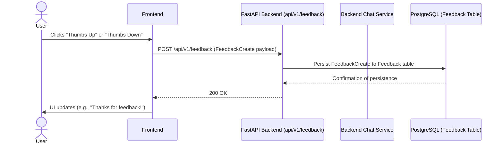
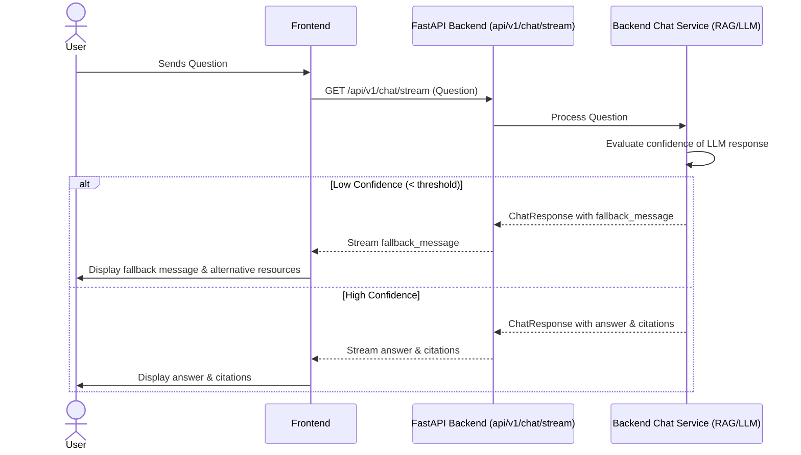

# Epic Technical Specification: Robustness, Reliability & Feedback

Date: Monday, 8 December 2025
Author: BIP
Epic ID: 4
Status: Draft

---

## Overview

Epic 4: Robustness, Reliability & Feedback focuses on enhancing the chatbot's ability to gracefully handle situations where it cannot confidently answer user queries, ensuring a continuous and valuable user experience. This epic also introduces mechanisms for continuous improvement by incorporating user feedback. It directly addresses Functional Requirements FR3.1 (fallback mechanism), FR3.2 (ambiguous query suggestions), and FR4.1 (user feedback).

## Objectives and Scope

**Objectives:**
*   To implement a robust fallback mechanism that guides users when the chatbot cannot confidently answer a question, providing alternative resources.
*   To enable the chatbot to suggest alternative or related topics for ambiguous user queries, improving clarity and user guidance.
*   To develop a user-friendly feedback mechanism (e.g., thumbs up/down) for each chatbot response to facilitate continuous improvement and performance monitoring.

**In-Scope:**
*   Implementation of an automatic fallback mechanism for low-confidence answers, as per FR3.1.
*   Development of a user feedback system (thumbs up/down) for individual chatbot responses, as per FR4.1.
*   Integration of an ambiguous query suggestion feature, as per FR3.2.
*   Storage of feedback data in the database.
*   Graceful handling of unanswerable queries in the UI.

**Out-of-Scope:**
*   Detailed analytics dashboards for feedback (beyond raw data storage).
*   Proactive assistance or complex troubleshooting flows.
*   Advanced natural language understanding for nuanced follow-up questions.
*   Integration with external support systems beyond providing contact information.

## System Architecture Alignment

This epic's implementation aligns with the defined system architecture by leveraging key backend components for feedback handling and error management. The feedback mechanism will utilize the `backend/app/api/v1/feedback.py` endpoint and store data via `backend/app/db/models.py`, ensuring data persistence through SQLAlchemy and PostgreSQL. Frontend integration will be managed by `frontend/components/FeedbackButtons.tsx`. The fallback mechanism will interact with the backend's core RAG pipeline and error handling middleware, ensuring consistent user messaging during unconfident responses.

## Detailed Design

### Services and Modules

| Module/Component           | Responsibility                                                | Inputs/Outputs                                                   | Owner         |
| :------------------------- | :------------------------------------------------------------ | :--------------------------------------------------------------- | :------------ |
| `backend/app/services/chat_service.py` | Implements core RAG logic, Pydantic AI agent, fallback logic for low-confidence answers, and ambiguous query suggestions. Orchestrates interaction with vector store and LLM. | **Inputs:** User question, chat history, (potentially) role context, confidence score. **Outputs:** Chat response (answer, citations, confidence, fallback message, suggestions). | Backend Dev   |
| `backend/app/db/models.py` | Defines the SQLAlchemy ORM model for `Feedback` to persist user feedback. | **Inputs:** Feedback data (chat_id, user_id, rating, comment). **Outputs:** Stored `Feedback` entity. | Backend Dev   |
| `backend/app/api/v1/feedback.py` | Exposes REST API endpoint for receiving user feedback.         | **Inputs:** `POST /api/v1/feedback` with `FeedbackCreate` Pydantic model. **Outputs:** `Feedback` entity or status. | Backend Dev   |
| `backend/app/schemas/chat.py` | Defines Pydantic models for chat requests and responses, including fields for confidence scores, fallback messages, and suggested queries. | **Inputs:** `ChatRequest` (question, role, chat_id). **Outputs:** `ChatResponse` (answer, citations, confidence, suggestions, etc.). | Backend Dev   |
| `frontend/components/FeedbackButtons.tsx` | Provides the UI for users to submit thumbs up/down feedback on chatbot responses. | **Inputs:** User interaction (click). **Outputs:** Dispatches feedback event/API call. | Frontend Dev  |
| `frontend/hooks/useChat.ts` | Manages chat state, SSE connection, and sends user input/feedback to the backend. | **Inputs:** User messages, feedback. **Outputs:** Chat history, streamed bot responses. | Frontend Dev  |

### Data Models and Contracts

**`Feedback` Model (`backend/app/db/models.py`)**

```python
from sqlalchemy import Column, Integer, String, DateTime, ForeignKey, Boolean
from sqlalchemy.sql import func
from app.db.base import Base

class Feedback(Base):
    __tablename__ = "feedback"

    id = Column(Integer, primary_key=True, index=True)
    chat_session_id = Column(String, index=True) # Link to a chat session, if tracked
    message_id = Column(String, index=True)      # Link to a specific message, if granular feedback
    rating = Column(String, nullable=False)       # e.g., "thumbs_up", "thumbs_down"
    user_id = Column(String, index=True, nullable=True) # Anonymous or logged-in user
    comment = Column(String, nullable=True)       # Optional free-text comment
    created_at = Column(DateTime, server_default=func.now())
    # Additional fields could include:
    # response_text = Column(String, nullable=True)
    # query_text = Column(String, nullable=True)
```

**`FeedbackCreate` Schema (`backend/app/schemas/feedback.py` - *anticipated*)**

```python
from pydantic import BaseModel
from typing import Optional

class FeedbackCreate(BaseModel):
    chat_session_id: str
    message_id: str
    rating: str # "thumbs_up" or "thumbs_down"
    user_id: Optional[str] = None
    comment: Optional[str] = None
```

**`ChatResponse` Schema (`backend/app/schemas/chat.py`)**

This schema will be extended to include fields for fallback messages and suggested queries.

```python
from pydantic import BaseModel, Field
from typing import List, Optional

class SourceCitation(BaseModel):
    title: str
    url: str

class ChatResponse(BaseModel):
    answer: str
    citations: List[SourceCitation] = Field(default_factory=list)
    confidence: Optional[float] = None
    fallback_message: Optional[str] = None # For FR3.1
    suggested_queries: List[str] = Field(default_factory=list) # For FR3.2
    # Other existing fields...
```

### APIs and Interfaces

**1. Feedback API Endpoint**

*   **Endpoint:** `POST /api/v1/feedback`
*   **Description:** Allows users to submit feedback (thumbs up/down) on a chatbot response.
*   **Request Model:** `FeedbackCreate` (`backend/app/schemas/feedback.py`)
    *   `chat_session_id` (str, required): Identifier for the chat session.
    *   `message_id` (str, required): Identifier for the specific chatbot message being rated.
    *   `rating` (str, required): "thumbs_up" or "thumbs_down".
    *   `user_id` (str, optional): Identifier for the user (if authenticated/tracked).
    *   `comment` (str, optional): Additional user comments.
*   **Response:** `200 OK` (successful submission), `422 Unprocessable Entity` (validation error).
*   **Error Codes:** Standard FastAPI HTTP exceptions.

**2. Chat API Interface (`backend/app/api/v1/chat.py`)**

The existing `/api/v1/chat/stream` endpoint's response model will be extended to include `fallback_message` and `suggested_queries` to support FR3.1 and FR3.2.

*   **Endpoint:** `GET /api/v1/chat/stream` (existing SSE endpoint)
*   **Description:** Streams chatbot responses, now potentially including fallback messages and query suggestions.
*   **Response Model:** `ChatResponse` (streamed as JSON objects or similar)
    *   Includes `answer`, `citations`, `confidence`, `fallback_message`, `suggested_queries`.

### Workflows and Sequencing

**1. User Feedback Submission (Story 4.2)**



**2. Automatic Fallback Mechanism (Story 4.1)**



**3. Ambiguous Query Suggestion (Story 4.3)**

```mermaid
sequenceDiagram
    actor User
    participant Frontend
    participant BackendAPI as FastAPI Backend (api/v1/chat/stream)
    participant ChatService as Backend Chat Service (RAG/LLM)

    User->>Frontend: Sends Ambiguous Question
    Frontend->>BackendAPI: GET /api/v1/chat/stream (Question)
    BackendAPI->>ChatService: Process Question
    ChatService->>ChatService: Detect ambiguity (via LLM/RAG)
    ChatService->>ChatService: Generate suggested_queries (via LLM)
    ChatService-->>BackendAPI: ChatResponse with suggested_queries
    BackendAPI-->>Frontend: Stream suggested_queries
    Frontend->>User: Display clickable suggested queries
    User->>Frontend: Clicks a suggested query
    Frontend->>BackendAPI: GET /api/v1/chat/stream (New Question)
    BackendAPI->>ChatService: Process New Question

## Non-Functional Requirements

### Performance

The primary performance metric for Epic 4 is the efficiency of the fallback and suggestion mechanisms.
*   **Response Time:** While the overall chatbot response time (under 5 seconds, as per PRD) is a system-wide NFR, the specific implementations within Epic 4 (fallback, suggestions) must not introduce noticeable delays. The fallback mechanism should be near-instantaneous upon confidence assessment. Ambiguous query suggestions should be generated and presented within the typical response window (e.g., within 5 seconds).
*   **Scalability:** The implemented feedback API and the logic for fallback/suggestions must be designed to scale with increasing user load without degrading performance for the core chat functionality.

### Security

Epic 4's security considerations primarily revolve around the new feedback mechanism and the robustness of the fallback/suggestion systems.
*   **Input Validation:** All inputs to the `/api/v1/feedback` endpoint must undergo strict Pydantic validation to prevent injection attacks or malformed data.
*   **Access Control (for Feedback):** While the MVP does not require user authentication, any future authenticated feedback submissions must ensure user context is securely managed. For now, feedback can be anonymous or linked to a session ID.
*   **Data Integrity:** Ensure that feedback data (rating, comments) is stored securely and immutably in the PostgreSQL database.
*   **Protection against Abuse:** The feedback mechanism should consider potential for abuse (e.g., spamming negative feedback). Rate limiting on the feedback API, if not already implemented system-wide (as per Epic 5), should be considered here.
*   **No Sensitive Data Handling:** As per PRD, the system must not store, process, or have access to any personal or regulated data, including within the feedback comments.

### Reliability/Availability

Epic 4 significantly contributes to the perceived reliability of the chatbot by addressing scenarios where the core RAG pipeline might fail to provide a confident answer.
*   **Graceful Degradation:** The automatic fallback mechanism ensures that if the chatbot cannot provide a confident answer, it gracefully informs the user and provides actionable alternatives (e.g., support links, rephrasing suggestions), preventing a hard failure or confusing response. This directly improves the user's perception of reliability.
*   **Error Handling:** The feedback submission API must be highly available and resilient to network issues or database transient failures. Standard FastAPI error handling and robust database connection management (via SQLAlchemy) will contribute to this.
*   **System Stability:** The implementation of ambiguous query suggestions and fallback logic should be stable and not introduce crashes or unexpected behavior.

### Observability

Effective observability for Epic 4 components is crucial for monitoring the chatbot's performance, identifying areas for improvement, and troubleshooting issues.
*   **Logging:**
    *   **Feedback API:** All feedback submissions (successes and failures) should be logged, including relevant metadata (e.g., `chat_session_id`, `message_id`, `rating`).
    *   **Fallback Trigger:** Logs should be generated whenever the automatic fallback mechanism is triggered, including the query that led to the fallback and the confidence score. This helps identify common "unanswerable" questions.
    *   **Ambiguous Query Detection:** Log instances where ambiguous queries are detected and suggestions are offered, as well as user interactions with these suggestions.
*   **Metrics:**
    *   **Feedback Rate:** Track the frequency of "thumbs up" vs. "thumbs down" feedback.
    *   **Fallback Rate:** Monitor how often the fallback mechanism is activated.
    *   **Suggestion Click-Through Rate:** Measure how often users interact with ambiguous query suggestions.
    *   **API Latency/Errors:** Standard API monitoring for the feedback endpoint.
*   **Alerting:** Alerts should be configured for sudden spikes in feedback API errors or an unexpectedly high fallback rate, which could indicate a problem with the RAG pipeline or a new type of query.

## Dependencies and Integrations

*   **FastAPI & Pydantic:** Core frameworks for the feedback API and schema validation.
*   **SQLAlchemy & PostgreSQL (Supabase):** Required for defining the `Feedback` model and persisting feedback data.
*   **ChromaDB & Gemini (Pydantic AI):** The fallback and suggestion mechanisms heavily rely on the RAG pipeline. The confidence score generation and ambiguity detection will likely involve prompt engineering with the LLM.
*   **Frontend (Next.js/React):** Integration required for the `FeedbackButtons` component and handling the display of fallback messages/suggestions in the chat stream.
*   **Logging System:** Integration with the centralized logging configuration (`backend/app/core/logging.py`) to capture feedback and fallback events.

## Acceptance Criteria (Authoritative)

**Story 4.1: Implement Automatic Fallback Mechanism**
1.  **Low Confidence Detection:** The system must accurately detect when the confidence score of a RAG-generated answer falls below a configurable threshold (e.g., 0.7).
2.  **Fallback Message:** When low confidence is detected, the system must return a specific fallback message: "Jeg fant ikke et klart svar i dokumentasjonen for dette spørsmålet. Kan du utdype spørsmålet? ..."
3.  **Support Link:** The fallback response must include a link to the general documentation or a support contact page.
4.  **No Hallucination:** The system must NOT attempt to fabricate an answer when confidence is low.

**Story 4.2: Develop User Feedback Mechanism (Thumbs Up/Down)**
1.  **UI Visibility:** Thumbs up and Thumbs down buttons must be visible below every chatbot response bubble.
2.  **Submission:** Clicking a button must send a POST request to `/api/v1/feedback` with the correct `message_id`, `chat_session_id`, and `rating`.
3.  **Persistence:** The feedback must be successfully stored in the `feedback` database table.
4.  **User Confirmation:** The UI must provide immediate visual confirmation (e.g., button state change, "Thank you" toast) after submission.
5.  **One Vote Per Message:** Users should be prevented from submitting multiple conflicting votes for the same message (handled via UI state or backend validation).

**Story 4.3: Implement Ambiguous Query Suggestion**
1.  **Ambiguity Detection:** The system must identify ambiguous queries (e.g., "Tell me about rules") where multiple distinct topics could apply.
2.  **Suggestion Generation:** The system must generate 2-3 specific, relevant follow-up questions or topics based on the ambiguous query.
3.  **UI Presentation:** Suggestions must be displayed as clickable buttons or links in the chat interface.
4.  **Interaction:** Clicking a suggestion must immediately trigger a new search/chat request with that specific query.

## Traceability Mapping

| Acceptance Criteria ID | Functional Requirement | Component(s) | Test Idea |
| :--------------------- | :--------------------- | :----------- | :-------- |
| AC-4.1.1 (Low Conf)    | FR3.1 (Fallback)       | `ChatService`, `Gemini` | Unit test: Mock low confidence score from LLM, verify fallback triggers. |
| AC-4.1.2 (Fallback Msg)| FR3.1 (Fallback)       | `ChatService` | Integration test: Send nonsense query, verify exact fallback text in response. |
| AC-4.2.1 (UI Buttons)  | FR4.1 (Feedback)       | `FeedbackButtons.tsx` | Component test: Render message, check button existence. |
| AC-4.2.3 (Persistence) | FR4.1 (Feedback)       | `feedback.py`, `models.py` | Integration test: POST to feedback API, query DB to verify record. |
| AC-4.3.1 (Ambiguity)   | FR3.2 (Suggestions)    | `ChatService`, `Gemini` | Unit test: Mock ambiguous query context, verify suggestions generated. |
| AC-4.3.4 (Interaction) | FR3.2 (Suggestions)    | `useChat.ts`, `ChatWindow` | E2E test: Click suggestion, verify new chat bubble appears with answer. |

## Risks, Assumptions, Open Questions

*   **Risk:** Users might abuse the feedback mechanism (spamming). **Mitigation:** Implement rate limiting (Story 5.1 covers API wide, but specific logic might be needed here).
*   **Risk:** Ambiguity detection might be too aggressive, suppressing valid direct answers. **Mitigation:** Tune the confidence threshold carefully during testing.
*   **Assumption:** The LLM (Gemini 2.5 Pro) is capable of reliably returning a confidence score or probability metric that maps well to "truthfulness".
*   **Assumption:** Users understand the "Thumbs Up/Down" metaphor for helpfulness.
*   **Question:** Should we allow users to change their vote? (MVP decision: No, or simple UI toggle).

## Test Strategy Summary

*   **Unit Testing:**
    *   Test `ChatService` logic for confidence threshold comparison and fallback triggering.
    *   Test `ChatService` prompt generation for ambiguous queries.
    *   Test `Feedback` Pydantic models for validation.
*   **Integration Testing:**
    *   Test the `/api/v1/feedback` endpoint with a real DB connection to ensure data persistence.
    *   Test the `/api/v1/chat/stream` endpoint to verify it delivers fallback messages and suggestions correctly in the stream.
*   **E2E Testing (Playwright):**
    *   Simulate a user flow: Ask unknown question -> Verify Fallback.
    *   Simulate a user flow: Ask ambiguous question -> Click suggestion -> Verify Answer.
    *   Simulate a user flow: Receive Answer -> Click Thumbs Up -> Verify UI confirmation.
*   **Manual Testing:**
    *   "Vibe check" the tone of the fallback message and suggestions.
    *   Verify the responsiveness of the feedback buttons on mobile devices.
