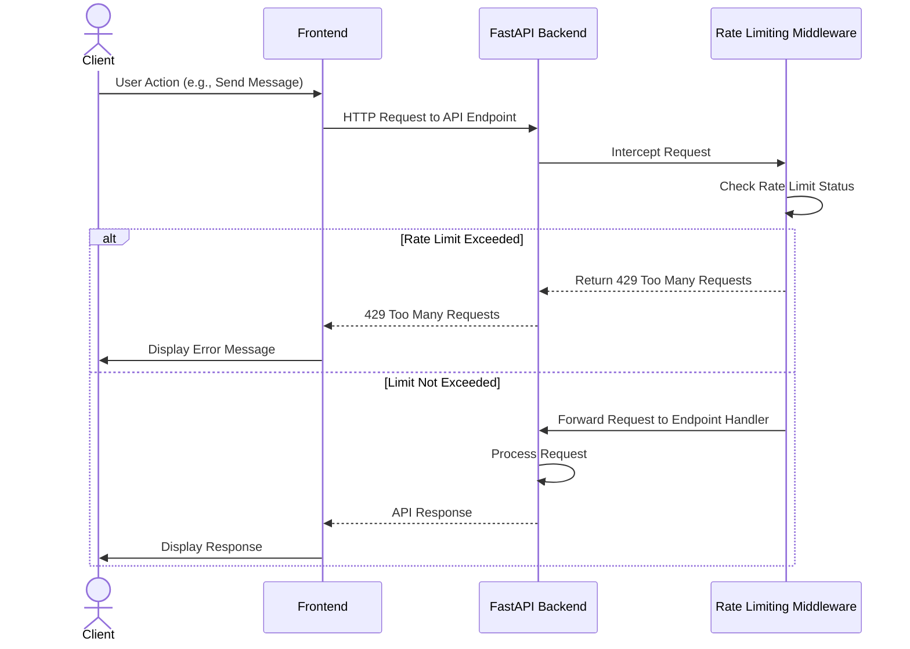
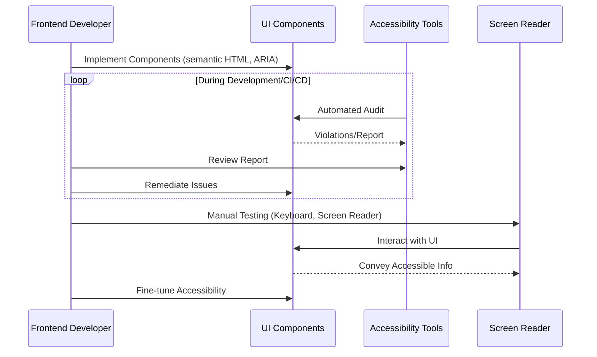
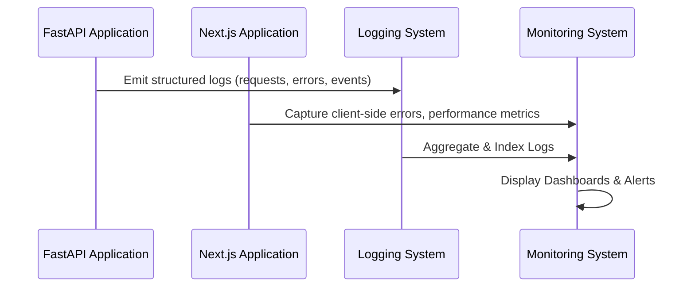
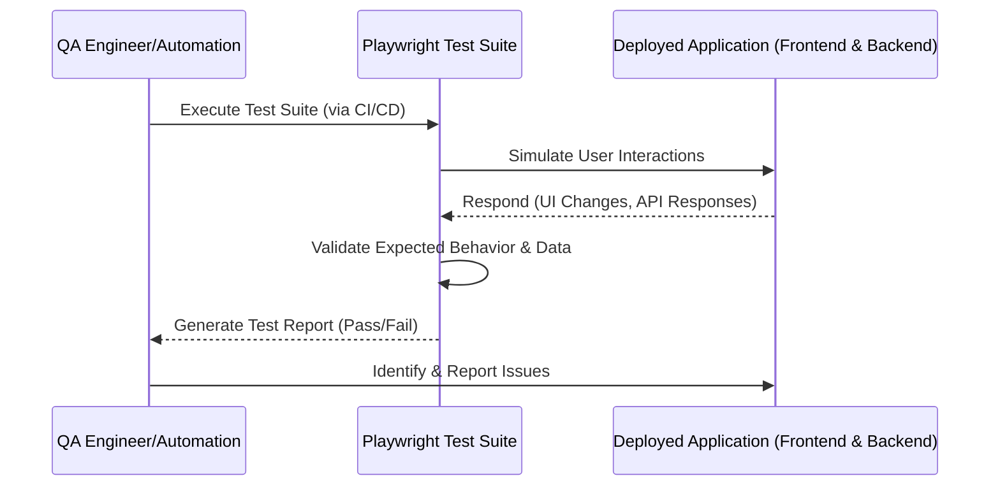

# Epic Technical Specification: Production Readiness & Accessibility

Date: Monday, 8 December 2025
Author: BIP
Epic ID: 5
Status: Draft

---

## Overview

Epic 5: Production Readiness & Accessibility focuses on preparing the chatbot application for public deployment by ensuring it meets critical non-functional requirements. This includes implementing robust API rate limiting to protect against abuse, ensuring the frontend adheres to WCAG 2.1 AA accessibility standards for inclusive use, establishing comprehensive logging and monitoring for operational visibility, and conducting thorough end-to-end testing to validate all features. This epic directly addresses Functional Requirement FR5.1 (WCAG 2.1 AA standards).

## Objectives and Scope

**Objectives:**
*   To safeguard the system against abuse and ensure stability by implementing API rate limiting.
*   To make the chatbot accessible to all users, including those with disabilities, by achieving WCAG 2.1 AA compliance for the frontend.
*   To establish clear operational visibility through comprehensive logging and monitoring across the application.
*   To validate the complete system functionality and integration through rigorous end-to-end testing.

**In-Scope:**
*   Implementation of API rate limiting on all backend endpoints.
*   Frontend audit and remediation to ensure WCAG 2.1 AA compliance.
*   Development of a comprehensive logging framework for both frontend and backend.
*   Integration of monitoring tools to track application health and performance.
*   Execution of a final end-to-end test suite.

**Out-of-Scope:**
*   Advanced security features beyond rate limiting (e.g., WAF, advanced intrusion detection).
*   Accessibility features beyond WCAG 2.1 AA compliance (e.g., full cognitive accessibility).
*   Real-time alerting configuration (beyond logging).
*   Detailed performance testing (beyond E2E functional verification).

## System Architecture Alignment

This epic's implementation aligns with the defined system architecture by integrating crucial non-functional components across the stack. API rate limiting will be implemented as `backend/app/middleware/rate_limit.py` to protect endpoints. Comprehensive logging will be established via `backend/app/core/logging.py` for structured output. Frontend accessibility (`WCAG 2.1 AA`) will be achieved through careful component design and validated via `frontend/tests/a11y/` (or similar accessibility testing within the E2E suite). End-to-end testing will utilize existing CI/CD pipelines to validate the integrated system.

## Detailed Design

### Services and Modules

| Module/Component           | Responsibility                                                | Inputs/Outputs                                                   | Owner         |
| :------------------------- | :------------------------------------------------------------ | :--------------------------------------------------------------- | :------------ |
| `backend/app/middleware/rate_limit.py` | Implements API rate limiting logic for backend endpoints.  | **Inputs:** Incoming HTTP requests. **Outputs:** Blocks requests exceeding limits, allows valid requests. | Backend Dev   |
| `backend/app/core/logging.py` | Configures structured logging for the backend application.     | **Inputs:** Log messages from various modules. **Outputs:** Formatted log output to console/file/monitoring system. | Backend/DevOps |
| `frontend/components/*`    | Frontend UI components must be developed with WCAG 2.1 AA compliance in mind. | **Inputs:** User interactions. **Outputs:** Accessible UI elements. | Frontend Dev  |
| `frontend/tests/e2e/*`     | Contains Playwright end-to-end tests to validate application flows. | **Inputs:** Test scenarios. **Outputs:** Test reports (pass/fail). | QA/Full-stack |
| `frontend/tests/a11y/*`    | (Anticipated) Dedicated accessibility test suite for frontend components. | **Inputs:** UI snapshots, accessibility rules. **Outputs:** Accessibility violation reports. | Frontend Dev  |

### Data Models and Contracts

This epic primarily focuses on non-functional aspects and does not introduce new core domain data models.
*   **Existing Data Models:** The `ChatSession` and `Feedback` models (from previous epics) will be implicitly subject to the new logging and monitoring requirements.
*   **Configuration:** Rate limiting parameters (e.g., `rate_limit_per_minute`, `rate_limit_per_hour`) will be managed via `app/core/config.py` and environment variables.
*   **Logging Data:** Log records generated by the comprehensive logging system (e.g., structured JSON logs) are a form of data, but are typically managed by external logging platforms, not persisted in the primary application database.

### APIs and Interfaces

This epic primarily enhances the robustness and observability of existing APIs rather than introducing new endpoint interfaces.
*   **Rate Limiting Middleware:** The `backend/app/middleware/rate_limit.py` will intercept all incoming API requests (e.g., `/api/v1/chat/stream`, `/api/v1/feedback`) and apply configured rate limits before they reach the endpoint logic. Clients exceeding the limit will receive a `429 Too Many Requests` HTTP status.
*   **Logging Integration:** All existing and future API endpoints will implicitly integrate with the configured logging system (`backend/app/core/logging.py`) to produce structured logs for requests, responses, and errors. No change to the API contract itself is expected.
*   **Accessibility:** Frontend API calls will need to consider accessibility aspects, ensuring error messages and loading states are communicated effectively to screen readers via ARIA attributes.

### Workflows and Sequencing

**1. API Rate Limiting (Story 5.1)**

**2. WCAG 2.1 AA Compliance (Story 5.2)**

**3. Comprehensive Logging and Monitoring (Story 5.3)**

**4. Final End-to-End Testing (Story 5.4)**

## Non-Functional Requirements

### Performance

*   **API Rate Limiting Overhead:** The rate limiting middleware should introduce minimal overhead to API request processing. The latency added by the middleware should be negligible (e.g., < 5ms).
*   **Logging Performance:** The structured logging mechanism must be performant, ensuring that log generation and processing do not significantly impact application response times. Asynchronous logging should be considered if synchronous logging becomes a bottleneck.
*   **End-to-End Test Execution:** The E2E test suite should execute within a reasonable timeframe (e.g., < 30 minutes for the full suite in CI/CD) to provide rapid feedback.

### Security

*   **Rate Limiting Effectiveness:** The implemented API rate limiting must effectively prevent denial-of-service (DoS) attacks and API abuse. It should be configurable with clear thresholds (e.g., 60 requests per minute per IP/user as a default).
*   **Input Validation:** All logging inputs and parameters used in monitoring (if exposed via an API) must undergo strict input validation to prevent injection attacks or malformed data.
*   **Data Protection (Logs):** Log data must be treated as sensitive, ensuring no PII or regulated data is logged. Access to logging and monitoring systems must be restricted to authorized personnel.
*   **Frontend Security:** WCAG compliance contributes to security by reducing attack surface for certain types of injection (e.g., if content is dynamically rendered based on user input, ensuring it's accessible can prevent script injection).

### Reliability/Availability

*   **System Stability:** The API rate limiting middleware must be highly stable and robust, not introducing crashes or unexpected behavior under high load or when blocking requests.
*   **Logging System Reliability:** The logging infrastructure must be highly available and fault-tolerant to ensure that critical logs are not lost, even during application failures.
*   **Monitoring System Availability:** The monitoring system should be continuously available to provide real-time insights into application health.
*   **E2E Test Coverage:** The comprehensive E2E test suite ensures that critical user flows function reliably and that integrations across services are stable.

### Observability

*   **Structured Logging:** Both frontend and backend applications must emit structured (e.g., JSON) logs for all significant events, errors, and system states.
    *   **Backend:** `backend/app/core/logging.py` will configure Python's standard `logging` module to output JSON-formatted logs.
    *   **Frontend:** Client-side errors, performance metrics (e.g., Core Web Vitals), and user actions should be captured and sent to a monitoring service.
*   **Metrics:** Key performance indicators (e.g., API request rates, error rates, response times for specific endpoints) should be collected and exposed via a monitoring system.
*   **Alerting Integration:** The monitoring system should support configurable alerts based on predefined thresholds for critical metrics (e.g., high error rates, low availability).
*   **Traceability:** Logs should include correlation IDs to trace requests across different services (frontend to backend).

## Dependencies and Integrations

*   **FastAPI & Uvicorn:** Middleware for rate limiting relies on FastAPI's dependency injection system and Uvicorn's ASGI capabilities.
*   **Redis (Optional but Recommended):** For distributed rate limiting in a scalable environment, Redis is a standard dependency. For MVP, in-memory rate limiting might suffice but Redis is preferred for robustness.
*   **Playwright:** The core framework for End-to-End testing.
*   **Axe-core / jest-axe:** Essential tools for automated accessibility testing within the frontend test suite.
*   **Logging Library:** Python's built-in `logging` module, potentially enhanced with `structlog` for easier JSON formatting.
*   **Monitoring Service (e.g., Prometheus/Grafana, Datadog, or Platform Native):** Integration with an external monitoring platform is required to visualize logs and metrics. For Railway/Vercel, this might involve their native observability tools.

## Acceptance Criteria (Authoritative)

**Story 5.1: Implement API Rate Limiting**
1.  **Enforcement:** Requests exceeding the configured limit (e.g., 60/min) must be rejected with HTTP status `429 Too Many Requests`.
2.  **Headers:** Responses should include standard rate limit headers (e.g., `X-RateLimit-Limit`, `X-RateLimit-Remaining`, `Retry-After`).
3.  **Configurability:** Rate limits must be configurable via environment variables without code changes.
4.  **Exemption:** Internal services or specific whitelisted IPs (if any) should be exempt from rate limiting (optional for MVP).

**Story 5.2: Ensure WCAG 2.1 AA Compliance for Frontend**
1.  **Automated Audit:** An automated accessibility audit (using Axe) of the entire application must return zero "critical" or "serious" violations.
2.  **Keyboard Navigation:** All interactive elements (buttons, inputs, links, chat interface) must be fully navigable and usable with a keyboard alone.
3.  **Screen Reader Support:** Screen readers (e.g., NVDA, VoiceOver) must correctly announce all dynamic content updates, including new chat messages and error notifications.
4.  **Contrast:** Text and interactive elements must meet the minimum color contrast ratio of 4.5:1 for normal text.

**Story 5.3: Implement Comprehensive Logging and Monitoring**
1.  **Structured Format:** Backend logs must be output in valid JSON format in the production environment.
2.  **Content:** Logs must capture HTTP method, path, status code, response time, and correlation ID for every API request.
3.  **Error Capture:** Uncaught exceptions and 500 errors must be logged with a full stack trace.
4.  **Frontend Errors:** Unhandled frontend exceptions must be caught and reported to the logging/monitoring system.

**Story 5.4: Conduct Final End-to-End Testing**
1.  **Coverage:** The E2E test suite must cover the critical user journey: Landing -> Role Selection -> Chat (RAG) -> Feedback.
2.  **Execution:** The test suite must run successfully in the CI/CD pipeline environment.
3.  **Pass Rate:** All critical tests must pass (100% pass rate for release).
4.  **Stability:** Tests should not be flaky (i.e., they consistently pass without retries).

## Traceability Mapping

| Acceptance Criteria ID | Functional Requirement | Component(s) | Test Idea |
| :--------------------- | :--------------------- | :----------- | :-------- |
| AC-5.1.1 (Enforcement) | NFR (Security/Stability)| `rate_limit.py` | Integration: Send 61 requests in 1 min, verify 61st is 429. |
| AC-5.2.1 (Auto Audit)  | FR5.1 (Accessibility)  | Frontend UI | Auto: Run `jest-axe` on all page components. |
| AC-5.2.2 (Keyboard)    | FR5.1 (Accessibility)  | Frontend UI | Manual/E2E: Playwright test traversing UI with `Tab` key. |
| AC-5.3.1 (JSON Logs)   | NFR (Observability)    | `logging.py` | Unit: verify log output format is valid JSON. |
| AC-5.4.1 (E2E Coverage)| All FRs (Verification) | `tests/e2e/` | System: Execute full suite, verify no failures. |

## Risks, Assumptions, Open Questions

*   **Risk:** Rate limiting might inadvertently block legitimate traffic if shared IPs (e.g., corporate NATs) are used heavily. **Mitigation:** Implement a whitelist or use more granular identification (e.g., session tokens) if possible.
*   **Risk:** Achieving 100% WCAG AA compliance might require significant UI refactoring if initial components weren't built with accessibility in mind. **Mitigation:** Prioritize critical violations and use automated tools early.
*   **Assumption:** The monitoring platform (e.g., Vercel/Railway built-in) provides sufficient data retention and query capabilities for our needs.
*   **Question:** What is the exact definition of "End-to-End" for this project? Does it include live testing against the production endpoint, or just staging? (Assumption: Staging/CI environment).

## Test Strategy Summary

*   **Unit Testing:**
    *   Verify rate limiting logic (token bucket algorithm or similar) in isolation.
    *   Verify log formatting correctness.
*   **Integration Testing:**
    *   Test middleware integration with FastAPI app to ensure requests are intercepted.
    *   Test accessibility of individual React components using `jest-axe`.
*   **E2E Testing (Playwright):**
    *   **Functional:** Complete regression test of all user flows.
    *   **Accessibility:** Automated scans of all pages during E2E runs.
    *   **Security:** Verify rate limits by flooding the staging API.
*   **Manual Testing:**
    *   **Accessibility:** Screen reader walkthrough (NVDA/VoiceOver) of the core chat flow.
    *   **Exploratory:** QA review of logs and dashboards during load testing.
